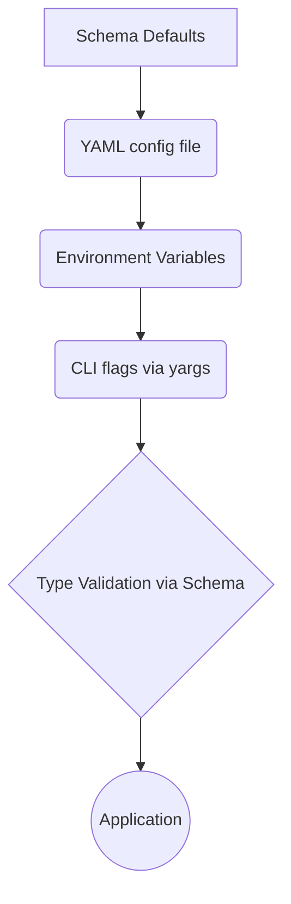
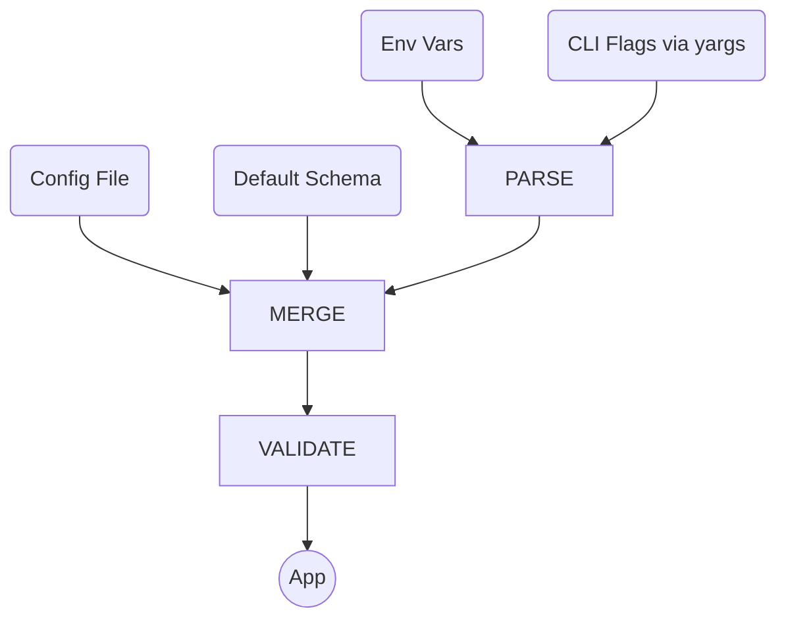

# dvmcp-bridge Configuration System Redesign Plan (Yargs-Integrated)

---

## Goals

- **Single Source of Truth:** Centralize configuration schema in TypeScript—used for CLI flags, config file types, and docs.
- **Composable Multi-source Override:** Seamlessly layer YAML, environment variables, and CLI (with arrays/objects supported via CSV/JSON).
- **Minimal Complexity:** Leverage yargs for robust CLI parsing, help, validation, and structuring.
- **Reusable Across Packages:** Share schema, loader, and CLI setup as a package-wide building block.

---

## Architecture

### 1. Config Schema (TypeScript)

Define a config `schema` as a TypeScript object (or type/interface + metadata), e.g.

```ts
// dvmcpConfigSchema.ts
export const dvmcpConfigSchema = {
  nostr: {
    privateKey: { type: 'string', required: true, doc: 'Hex private key' },
    relayUrls: { type: 'array', itemType: 'string', required: true, doc: 'Relays' }
  },
  mcp: {
    name: { type: 'string', default: 'DVM MCP Bridge' },
    about: { type: 'string' },
    clientName: { type: 'string', required: true },
    clientVersion: { type: 'string', required: true },
    servers: {
      type: 'array', itemType: 'object',
      fields: {
        name: { type: 'string', required: true },
        command: { type: 'string', required: true },
        args: { type: 'array', itemType: 'string', required: true },
        env: { type: 'object', keyType: 'string', valueType: 'string' },
        tools: {
          type: 'array', itemType: 'object',
          fields: {
            name: { type: 'string', required: true },
            price: { type: 'string' },
            unit: { type: 'string', default: 'sats' }
          }
        }
      }
    }
  },
  // ...rest of config
}
```

This schema is used to:
- Define all CLI/options in `yargs`
- Drive config file structure and validation
- Power docs and type inference

---

### 2. Configuration Source Flow



- **Defaults:** Pulled from schema
- **YAML File:** Parsed (YAML → JS object), overrides defaults (`.config()` in yargs supports this)
- **Env Vars:** Loaded, mapped to config shape; arrays/objects use JSON or CSV
- **CLI Args:** Parsed and validated with yargs, layered on top (highest precedence)
- **Validation:** Schema validation at the end; errors if missing/invalid

---

### 3. Implementation Details with yargs

- Use yargs for all CLI parsing and help output (auto-generated from schema).
    - Handles arrays/objects with proper flags: `--nostr.relayUrls ws://x,ws://y`, `--mcp.servers '[{"name":"a",...}]'`
    - Dotted notation and aliases for nested fields
    - Type-safe arguments; built-in validation and error messages
- Use yargs’s `.config()` to load YAML/JSON config from file path (can load from user-specified file).
- Add custom loader for env vars:
    - Flat vars (e.g. `MCP_CLIENT_NAME`)
    - Nested vars as JSON (e.g. `MCP_SERVERS='[{"name":"foo",...}]'`) or CSV where reasonable
    - Convert string envs to typed objects for yargs

---

### 4. Unified Merging Logic

Order of merging is:
1. **Defaults** (from schema)
2. **YAML file** (if found—loaded early)
3. **Environment Variables** (JSON/CSV-handled for complex types)
4. **CLI args** (parsed by yargs)

Arrays/objects from env/CLI **replace** lower-priority values (do not merge recursively, to avoid ambiguity).

---

### 5. Validation & Type Safety

- At the end, validate merged config against schema: required fields, allowed values, types, arrays length, etc.
- Report errors referencing option names and sources.

---

### 6. Example Usage Table

| Source   | Key                                         | Example Value                           |
|----------|---------------------------------------------|-----------------------------------------|
| YAML     | mcp.servers                                 | As array of objects                     |
| Env      | MCP_SERVERS                                 | `[{"name":"foo","command":"node",...}]` |
| Env      | NOSTR_RELAY_URLS                            | `wss://relay1,wss://relay2`             |
| CLI      | --mcp.servers                               | `'[{"name":"foo",...}]'`                |
| CLI      | --nostr.relayUrls                           | `wss://r1,wss://r2`                     |
| CLI      | --mcp.name                                  | `'BridgeName'`                          |

---

## Benefits Overview

- **Less Custom Code:** CLI, help, and validation handled by yargs.
- **Easier to Extend:** Add/rename options in schema; all sources map automatically.
- **Powerful Help & UX:** yargs help output is always up to date and supports nested/complex config.
- **Configurable Everywhere:** Supports “headless” (env/CLI) overrides for all options, including arrays and objects via JSON/CSV.

---

## Action Steps

1. **Define (and if possible, auto-generate) config schema in TypeScript.**
2. **Refactor CLI entrypoint:**
    - Migrate to yargs parsing/config loading for all CLI commands/options
    - Use `.config()` for YAML, and add custom env var loader layer
3. **Layer/merge` config: defaults < yaml < env < CLI (yargs)`.
4. **Validate against schema; report errors early.**
5. **Replace existing config usage to single source.**
6. **Document patterns for downstream packages.**

---

## Mermaid Diagram



---

Adopting this approach with yargs as the CLI/config orchestrator will result in a modern, unified configuration system—easy for maintainers, flexible for power-users, and reusable across your packages.