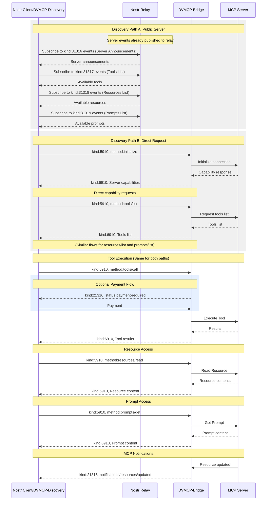

# DVMCP

## MCP Integration for Nostr

`draft` `mcp:2025-03-26` `rev1`

This document defines how Nostr and Data Vending Machines can be used to expose Model Context Protocol (MCP) server capabilities, enabling standardized usage of these resources for both machines and humans.

## Table of Contents

- [Introduction](#introduction)
- [Motivation](#motivation)
- [Protocol Overview](#protocol-overview)
- [Protocol Consistency](#protocol-consistency)
  - [Message Structure Consistency](#message-structure-consistency)
- [Event Kinds](#event-kinds)
- [Server Discovery](#server-discovery)
  - [Discovery via Server Announcements (Public Servers)](#discovery-via-server-announcements-public-servers)
  - [Direct Discovery (Private Servers)](#direct-discovery-private-servers)
- [Capability Operations](#capability-operations)
  - [List Operations](#list-operations)
  - [Tools](#tools)
  - [Resources](#resources)
  - [Prompts](#prompts)
- [Notifications](#notifications)
  - [MCP Notifications](#mcp-notifications)
  - [Nostr-Specific Notifications](#nostr-specific-notifications)
- [Error Handling](#error-handling)
  - [Error Types](#error-types)
- [Implementation Requirements](#implementation-requirements)
- [Complete Protocol Flow](#complete-protocol-flow)
- [Subscription Management](#subscription-management)

## Introduction

The [Model Context Protocol](https://modelcontextprotocol.io/introduction) provides a protocol specification to create servers exposing capabilities and clients consuming them. Meanwhile, the Nostr network and Data Vending Machines offer a decentralized way to announce and consume computational services. This specification defines how to bridge these protocols, allowing MCP servers to advertise and provide their services through the Nostr network.

This specification aims to:

1. Enable discovery of MCP servers and their capabilities through the Nostr network
2. Provide a consistent experience for clients accessing capabilities, and servers exposing their capabilities
3. Maintain compatibility with both protocols while preserving their security models

By integrating these protocols, DVMCP combines the standardized capability framework of MCP with the decentralized, cryptographically secure messaging of Nostr. This integration enables several key advantages:

- **Discoverability**: MCP servers can be discovered through the Nostr network without centralized registries
- **Verifiability**: All messages are cryptographically signed using Nostr's public keys
- **Decentralization**: No single point of failure for service discovery or communication
- **Protocol Interoperability**: Both MCP and DVMs utilize JSON-RPC patterns, enabling seamless communication between the protocols
- **Client Compatibility**: Existing MCP and Nostr clients can interact with minimal adaptation

The integration preserves the security model of both protocols while enabling new patterns of interaction between humans, AI systems and computational services.

### Public Key Cryptography

DVMCP leverages Nostr's public key cryptography to ensure message authenticity and integrity:

1. **Message Verification**: Every message is cryptographically signed by the sender's private key and can be verified using their public key, ensuring that:
   - Server announcements come from legitimate providers
   - Client requests are from authorized users
   - Responses are from the expected servers

2. **Identity Management**: Public keys serve as persistent identifiers for all actors in the system:
   - Providers maintain consistent identities across relays
   - Clients can be uniquely identified for authorization purposes
   - Server identifiers are associated with provider public keys

3. **Authorization Flow**: The cryptographic properties enable secure authorization flows for paid services and private capabilities without requiring centralized authentication services.

## Protocol Overview

DVMCP bridges MCP and Nostr protocols through a consistent message structure and well-defined workflow.

### Message Structure

The protocol uses these key design principles for message handling:

1. **Content Field Structure**: The `content` field of Nostr events contains stringified MCP messages following the JSON-RPC pattern. This approach maintains protocol integrity while enabling translation between the two systems.

2. **Nostr Metadata in Tags**: All Nostr-specific metadata uses event tags:
   - `d`: Unique identifier for the event, used by servers to define their server identifier
   - `s`: Server identifier for targeting specific servers, should be the `d` tags of the server being targeted
   - `p`: Public key for addressing providers or clients
   - `e`: Event id, references for correlating requests and responses
   - `method`: Method name for easy filtering and routing

3. **Event Kind Separation**: Different event kinds are used for different message categories:
   - `31316`-`31319`: Server announcements and capability listings
   - `5910`: Client requests
   - `6910`: Server responses
   - `21316`: Notifications and feedback (ephemeral)

### Main Actors

There are four main actors in this workflow:

- **Providers**: Entities running MCP server(s), operating behind a Nostr public key
- **Servers**: MCP servers exposing capabilities, operated by a provider
- **DVMs**: Bridge protocol that translates between Nostr and MCP protocols
- **Clients**: MCP or Nostr clients that discover and consume capabilities from servers

### Protocol Flow

The protocol consists of three main phases:
1. **Discovery**: Finding available MCP servers in Nostr and retrieving available capabilities
2. **Capability Execution/Read**: Requesting tool execution, reading resources, or prompts, and receiving results
3. **Capability Feedback**: Status updates, notifications, and payment handling

## Event Kinds

This specification defines these event kinds:

| Kind  | Description                                      |
| ----- | ------------------------------------------------ |
| 31316 | Server Announcement (MCP server initialization)  |
| 31317 | Tools List                                       |
| 31318 | Resources List                                   |
| 31319 | Prompts List                                     |
| 5910  | Requests                                         |
| 6910  | Responses                                        |
| 21316 | Feedback/Notifications (Ephemeral)               |

## Server Discovery
DVMCP provides two methods of server discovery, the main differences between these two methods being the visibility of the servers and the way they are advertised. Public servers can advertise themselves and their capabilities to improve discoverability when providing a "public" or accessible service. Private servers may not advertise themselves and their capabilities, but they can be discovered by clients that know the provider's public key or server identifier.

### Discovery via Server Announcements (Public Servers)

Providers announce their servers and capabilities by publishing events with kinds 31316 (server), 31317 (tools/list), 31318 (resources/list), and 31319 (prompts/list).

#### Server Announcement Event

```json
{
  "kind": 31316,
  "pubkey": "<provider-pubkey>",
  "content": {
    "jsonrpc": "2.0",
    "id": 1,
    "result": {
      "protocolVersion": "2025-03-26",
      "capabilities": {
        "logging": {},
        "prompts": {
          "listChanged": true
        },
        "resources": {
          "subscribe": true,
          "listChanged": true
        },
        "tools": {
          "listChanged": true
        }
      },
      "serverInfo": {
        "name": "ExampleServer",
        "version": "1.0.0"
      },
      "instructions": "Optional instructions for the client"
    }
  },
  "tags": [
    ["d", "<server-identifier>"],          // Required: Unique identifier for the server
    ["name", "Example Server"],            // Optional: Human-readable server name
    ["about", "Server description"],       // Optional: Server description
    ["picture", "https://example.com/server.png"],  // Optional: Server icon/avatar URL
    ["website", "https://example.com"],    // Optional: Server website
    ["k", "5910"],                         // Required: Accepted event kinds (for requests)
    ["support_encryption", "true"]         // Optional: Whether server supports encrypted messages
  ]
}
```

#### Tools List Event
```json
{
  "kind": 31317,
  "pubkey": "<provider-pubkey>",
  "content": {
    "jsonrpc": "2.0",
    "id": 1,
    "result": {
      "tools": [
        {
          "name": "get_weather",
          "description": "Get current weather information for a location",
          "inputSchema": {
            "type": "object",
            "properties": {
              "location": {
                "type": "string",
                "description": "City name or zip code"
              }
            },
            "required": ["location"]
          }
        }
      ]
    }
  },
  "tags": [
    ["d", "<unique-identifier>"],        // Required: Unique identifier for the tools list
    ["s", "<server-identifier>"],        // Required: Reference to the server
    ["t", "get_weather"],                // Required: One t tag per tool name for enhanced discoverability
    ["t", "get_weather_future"] 
  ]
}
```

#### Resources List Event

```json
{
  "kind": 31318,
  "pubkey": "<provider-pubkey>",
  "content": {
    "jsonrpc": "2.0",
    "id": 1,
    "result": {
      "resources": [
        {
          "uri": "file:///project/src/main.rs",
          "name": "main.rs",
          "description": "Primary application entry point",
          "mimeType": "text/x-rust"
        }
      ]
    }
  },
  "tags": [
    ["d", "<unique-identifier>"],        // Required: Unique identifier for the resources list
    ["s", "<server-identifier>"],        // Required: Reference to the server
    ["t", "main.rs"]                    // Optional: One t tag per resource name for enhanced discoverability
  ]
}
```

#### Prompts List Event

```json
{
  "kind": 31319,
  "pubkey": "<provider-pubkey>",
  "content": {
    "jsonrpc": "2.0",
    "id": 1,
    "result": {
      "prompts": [
        {
          "name": "code_review",
          "description": "Asks the LLM to analyze code quality and suggest improvements",
          "arguments": [
            {
              "name": "code",
              "description": "The code to review",
              "required": true
            }
          ]
        }
      ]
    }
  },
  "tags": [
    ["d", "<unique-identifier>"],        // Required: Unique identifier for the prompts list
    ["s", "<server-identifier>"],        // Required: Reference to the server
    ["t", "code_review"]                // Optional: One t tag per prompt name for enhanced discoverability
  ]
}
```

### Direct Discovery (Private Servers)

For servers that are not publicly announced, clients can use the MCP initialization process:

#### Client Initialization Request

```json
{
  "kind": 5910,
  "content": {
    "jsonrpc": "2.0",
    "id": 1,
    "method": "initialize",
    "params": {
      "protocolVersion": "2025-03-26",
      "capabilities": {
        "roots": {
          "listChanged": true
        },
        "sampling": {}
      },
      "clientInfo": {
        "name": "ExampleClient",
        "version": "1.0.0"
      }
    }
  },
  "tags": [
    ["method", "initialize"],
    ["p", "<provider-pubkey>"]
    ["s", "<server-identifier>"]
  ]
}
```

- Tags:
  - `p`: Provider public key, to target all the servers from a provider
  - `s`: Server identifier, optional for target a server
  - `method`: Method name

#### Server Initialization Response

```json
{
  "kind": 6910,
  "pubkey": "<provider-pubkey>",
  "content": {
    "jsonrpc": "2.0",
    "id": 1,
    "result": {
      "protocolVersion": "2025-03-26",
      "capabilities": {
        "logging": {},
        "prompts": {
          "listChanged": true
        },
        "resources": {
          "subscribe": true,
          "listChanged": true
        },
        "tools": {
          "listChanged": true
        }
      },
      "serverInfo": {
        "name": "ExampleServer",
        "version": "1.0.0"
      },
      "instructions": "Optional instructions for the client"
    }
  },
  "tags": [
    ["e", "<client-init-request-id>"],
    ["d", "<server-identifier>"]
  ]
}
```

When a server responds to an initialization request, it includes a `d` tag in the response that serves as the server identifier. Clients should use this identifier in the `s` tag of subsequent requests to target this specific server. This approach allows clients to discover and interact with servers without prior knowledge of their identifiers.

- Tags:
  - `d`: Server identifier, uniquely identifies this server for future requests
  - `e`: Reference to the client's initialization request event
## Capability Operations

After initialization, clients can interact with server capabilities, even if the server is public, and its exposing capabilities publicly, you can still requesting list tools, resources, prompts, in order to use pagination if necessary:

### List Operations

DVMCP provides a consistent pattern for listing capabilities (tools, resources, and prompts). All list operations follow the same structure, with the specific capability type indicated in the method name.

#### List Request Template

```json
{
  "kind": 5910,
  "pubkey": "<client-pubkey>",
  "id": "<request-event-id>",
  "content": {
    "jsonrpc": "2.0",
    "id": "<request-id>",
    "method": "<capability>/list",  // tools/list, resources/list, or prompts/list
    "params": {
      "cursor": "optional-cursor-value"
    }
  },
  "tags": [
    ["method", "<capability>/list"],  // Required: Same as method in content for filtering
    ["p", "<provider-pubkey>"],       // Required: Provider's public key
    ["s", "<server-identifier>"]      // Required: Server identifier
  ]
}
```

#### List Response Template

```json
{
  "kind": 6910,
  "pubkey": "<provider-pubkey>",
  "content": {
    "jsonrpc": "2.0",
    "id": "<request-id>",
    "result": {
      "<items>": [  // "tools", "resources", or "prompts" based on capability
        // Capability-specific item objects
      ],
      "nextCursor": "next-page-cursor" 
    }
  },
  "tags": [
    ["e", "<request-event-id>"]        // Required: Reference to the request event
  ]
}
```

### Tools

#### Capability-Specific Item Examples

**Tool Item:**
```json
{
  "name": "get_weather",
  "description": "Get current weather information for a location",
  "inputSchema": {
    "type": "object",
    "properties": {
      "location": {
        "type": "string",
        "description": "City name or zip code"
      }
    },
    "required": ["location"]
  }
}
```


#### Call Tool Request

```json
{
  "kind": 5910,
  "pubkey": "<client-pubkey>",
  "id": "<request-event-id>",
  "content": {
    "jsonrpc": "2.0",
    "id": 3,
    "method": "tools/call",
    "params": {
      "name": "get_weather",
      "arguments": {
        "location": "New York"
      }
    }
  },
  "tags": [
    ["method", "tools/call"],
    ["p", "<provider-pubkey>"],
    ["s", "<server-identifier>"]
  ]
}
```

#### Call Tool Response

```json
{
  "kind": 6910,
  "pubkey": "<provider-pubkey>",
  "content": {
    "jsonrpc": "2.0",
    "id": 3,
    "result": {
      "content": [
        {
          "type": "text",
          "text": "Current weather in New York:\nTemperature: 72°F\nConditions: Partly cloudy"
        }
      ],
      "isError": false
    }
  },
  "tags": [
    ["e", "<request-event-id>"],
  ]
}
```

### Resources

**Resource Item Example:**
```json
{
  "uri": "file:///project/src/main.rs",
  "name": "main.rs",
  "description": "Primary application entry point",
  "mimeType": "text/x-rust"
}
```

#### Read Resource Request

```json
{
  "kind": 5910,
  "pubkey": "<client-pubkey>",
  "id": "<request-event-id>",
  "content": {
    "jsonrpc": "2.0",
    "id": 5,
    "method": "resources/read",
    "params": {
      "uri": "file:///project/src/main.rs"
    }
  },
  "tags": [
    ["method", "resources/read"],
    ["p", "<provider-pubkey>"],
    ["s", "<server-identifier>"]
  ]
}
```

#### Read Resource Response

```json
{
  "kind": 6910,
  "pubkey": "<provider-pubkey>",
  "content": {
    "jsonrpc": "2.0",
    "id": 5,
    "result": {
      "contents": [
        {
          "uri": "file:///project/src/main.rs",
          "mimeType": "text/x-rust",
          "text": "fn main() {\n    println!(\"Hello world!\");\n}"
        }
      ]
    }
  },
  "tags": [
    ["e", "<request-event-id>"]        // Required: Reference to the request event
  ]
}
```

### Prompts

**Prompt Item Example:**
```json
{
  "name": "code_review",
  "description": "Asks the LLM to analyze code quality and suggest improvements",
  "arguments": [
    {
      "name": "code",
      "description": "The code to review",
      "required": true
    }
  ]
}
```

#### Get Prompt Request

```json
{
  "kind": 5910,
  "pubkey": "<client-pubkey>",
  "id": "<request-event-id>",
  "content": {
    "jsonrpc": "2.0",
    "id": 7,
    "method": "prompts/get",
    "params": {
      "name": "code_review",
      "arguments": {
        "code": "def hello():\n    print('world')"
      }
    }
  },
  "tags": [
    ["method", "prompts/get"],
    ["p", "<provider-pubkey>"],
    ["s", "<server-identifier>"]
  ]
}
```

#### Get Prompt Response

```json
{
  "kind": 6910,
  "pubkey": "<provider-pubkey>",
  "content": {
    "jsonrpc": "2.0",
    "id": 7,
    "result": {
      "description": "Code review prompt",
      "messages": [
        {
          "role": "user",
          "content": {
            "type": "text",
            "text": "Please review this Python code:\ndef hello():\n    print('world')"
          }
        }
      ]
    }
  },
  "tags": [
    ["e", "<request-event-id>"]        // Required: Reference to the request event
  ]
}
```

## Notifications

Notifications in DVMCP are divided into two categories: MCP-compliant notifications that follow the Model Context Protocol specification, and Nostr-specific notifications that leverage Nostr's event-based architecture for features like payment handling.

For notifications, we use an ephemeral event type (21316), meaning they are not expected to be stored by relays.

### MCP-compliant Notifications

For MCP-compliant notifications, the content field follows the same pattern as other MCP messages, containing a stringified JSON RPC object that adheres to the MCP specification.

The direction of the notifications is determined by the `p` tag used. Client to server notifications are signed by the client pubkey and use the server pubkey as `p` tag, server to client notifications are signed by the server's provider pubkey and use the client pubkey as `p` tag.

#### Notification Template

```json
{
  "kind": 21316,
  "pubkey": "<provider-pubkey>",
  "content": {
    "jsonrpc": "2.0",
    "method": "notifications/<type>",
    "params": { /* Optional parameters */ }
  },
  "tags": [
    ["p", "<client-pubkey>"],                    // Required: Target public key (recipient)
    ["s", "<server-identifier>"],                // Required: Server identifier
    ["method", "notifications/<type>"],          // Required: Same as method in content
    ["e", "<request-event-id>"]                  // Optional: Reference to the request (for progress/cancel)
  ]
}
```

#### Common MCP Notifications

| Notification Type | Method | Direction | Parameters | Description |
|------------------|--------|-----------|------------|-------------|
| Tools List Changed | `notifications/tools/list_changed` | Server → Client | None | Sent when the list of available tools changes |
| Resources List Changed | `notifications/resources/list_changed` | Server → Client | None | Sent when the list of available resources changes |
| Resource Updated | `notifications/resources/updated` | Server → Client | `uri`: Resource URI | Sent when a specific resource is updated |
| Prompts List Changed | `notifications/prompts/list_changed` | Server → Client | None | Sent when the list of available prompts changes |
| Progress | `notifications/progress` | Server → Client | `id`: Request ID<br>`message`: Status message | Indicates progress on long-running operations |
| Cancel | `notifications/cancel` | Client → Server | `id`: Request ID | Cancels an in-progress operation |

**Note:** Progress notifications include an additional `e` tag referencing the request event ID:
```json
["e", "<request-id>"]  // Only for progress notifications
```

For long-running jobs, servers should send progress notifications frequently to indicate the job is still processing and to prevent client timeout.

### Nostr-Specific Notifications

For Nostr-specific features like payment handling, we use the event tags while keeping the content empty:

#### Payment Required Notification

```json
{
  "kind": 21316,
  "pubkey": "<provider-pubkey>",
  "content": "",
  "tags": [
    ["status", "payment-required"],              // Required: Indicates payment is needed
    ["amount", "1000", "lnbc..."],             // Required: Amount in sats and Lightning invoice
    ["e", "<job-request-id>"],                   // Required: Reference to the original request
    ["expiration", "<unix-timestamp>"]           // Optional: When the payment request expires
  ]
}
```

## Error Handling

DVMCP handles two types of errors: protocol errors and execution errors.

### Error Types

| Error Type | Description | Format |
|------------|-------------|--------|
| Protocol Error | JSON-RPC protocol-level errors (invalid method, params, etc.) | Error object in content with error code and message |
| Execution Error | Errors during tool execution (API failures, business logic errors) | Result object with `isError: true` and error details in content |

### Error Response Template

```json
{
  "kind": 6910,
  "pubkey": "<provider-pubkey>",
  "content": {
    "jsonrpc": "2.0",
    "id": "<request-id>",
    // Either an error object (protocol error):
    "error": {
      "code": -32602,  // Standard JSON-RPC error code
      "message": "Error description"
    },
    // Or a result with isError flag (execution error):
    "result": {
      "content": [
        {
          "type": "text",
          "text": "Error details"
        }
      ],
      "isError": true
    }
  },
  "tags": [
    ["e", "<request-event-id>"],                  // Required: Reference to the request event
  ]
}
```

**Common Error Codes:**
- `-32700`: Parse error
- `-32600`: Invalid request
- `-32601`: Method not found
- `-32602`: Invalid params
- `-32603`: Internal error
- `-32002`: Resource not found

## Implementation Requirements

### Providers and Servers MUST:

1. Use consistent server identifiers in the `d` tags
2. Include proper reference tags (`s` tags) for backward discovery
3. Structure event content as valid JSON-RPC stringified objects according to MCP specification
4. Respond to initialization requests with proper capability information
5. Include appropriate error information for failed requests
6. Process notifications according to the MCP specification
7. Use standard Nostr tags for Nostr-specific features (like payments)

### Clients MUST:

1. Include the proper server reference in the `s` tag for all requests
2. Parse JSON-RPC responses from the event content
3. Handle error conditions appropriately
4. Track event IDs for request-response correlation
## Complete Protocol Flow



## Subscription Management

Unlike direct MCP connections, Nostr's pub/sub model requires special handling for long-lived subscriptions:

1. **Connection Persistence**: Clients and servers SHOULD maintain relay connections to receive notifications for subscribed resources.

2. **Progress Notifications**: For long-running operations, servers SHOULD send progress notifications as defined in the protocol to:
   - Indicate processing status
   - Prevent client timeouts
   - Maintain subscription activity

3. **Subscription Termination**: Subscriptions can be terminated in several ways:
   - When the client receives a successful result
   - When an error occurs during processing
   - When the client explicitly sends a cancellation request
   - When the connection times out due to network issues