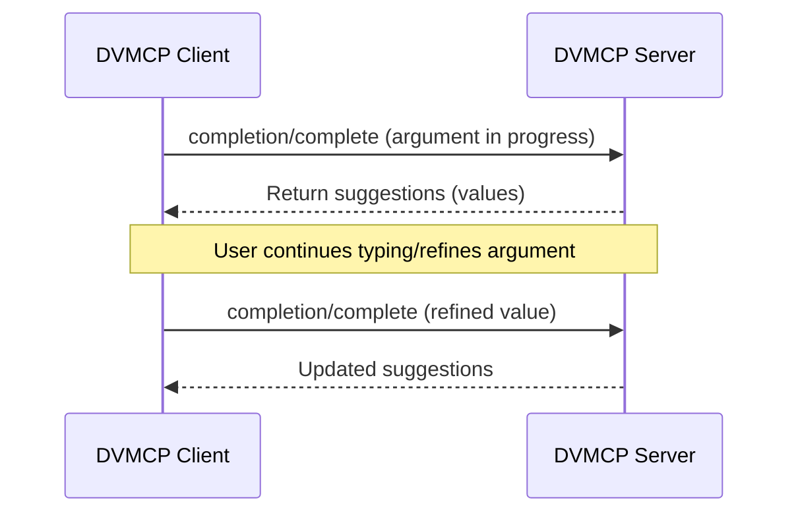
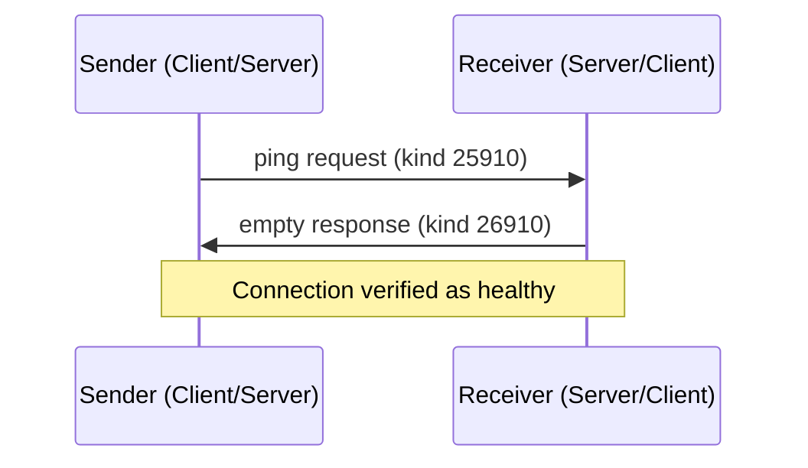
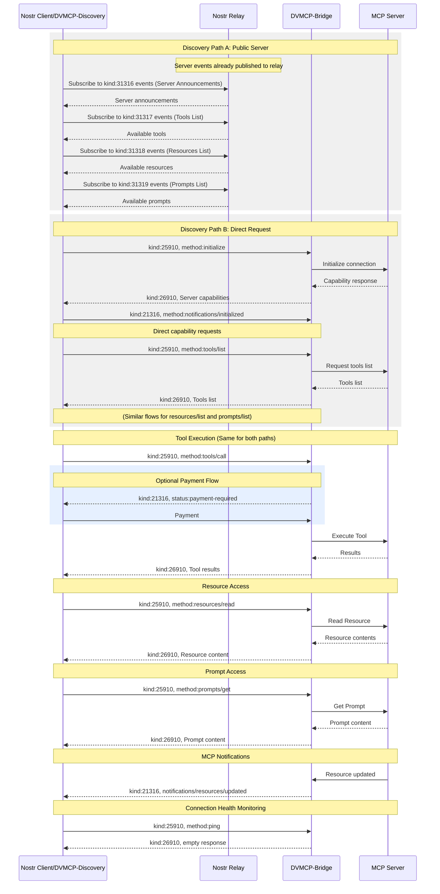

# DVMCP

## MCP Integration for Nostr

`draft` `mcp:2025-03-26` `rev1.1`

This document defines how Nostr and Data Vending Machines can be used to expose Model Context Protocol (MCP) server capabilities, enabling standardized usage of these resources.

## Table of Contents

- [Introduction](#introduction)
- [Motivation](#motivation)
- [Protocol Overview](#protocol-overview)
- [Protocol Consistency](#protocol-consistency)
  - [Message Structure Consistency](#message-structure-consistency)
- [Event Kinds](#event-kinds)
- [Server Discovery](#server-discovery)
  - [Discovery via Server Announcements (Public Servers)](#discovery-via-server-announcements-public-servers)
  - [Direct Discovery (Private Servers)](#direct-discovery-private-servers)
- [Capability Operations](#capability-operations)
  - [List Operations](#list-operations)
  - [Tools](#tools)
  - [Resources](#resources)
  - [Prompts](#prompts)
- [Completions](#completions)
- [Ping](#ping)
- [Notifications](#notifications)
  - [MCP Notifications](#mcp-notifications)
  - [Nostr-Specific Notifications](#nostr-specific-notifications)
- [Error Handling](#error-handling)
  - [Error Types](#error-types)
- [Implementation Requirements](#implementation-requirements)
- [Complete Protocol Flow](#complete-protocol-flow)
- [Subscription Management](#subscription-management)

## Introduction

The [Model Context Protocol](https://modelcontextprotocol.io/introduction) provides a protocol specification to create servers exposing capabilities and clients consuming them. Meanwhile, the Nostr network and Data Vending Machines offer a decentralized way to announce and consume computational services. This specification defines how to bridge these protocols, allowing MCP servers to advertise and provide their services through the Nostr network.

This specification aims to:

1. Enable discovery of MCP servers and their capabilities through the Nostr network
2. Provide a consistent experience for clients accessing capabilities, and servers exposing their capabilities
3. Maintain compatibility with both protocols while preserving their security models

By integrating these protocols, DVMCP combines the standardized capability framework of MCP with the decentralized, cryptographically secure messaging of Nostr. This integration enables several key advantages:

- **Discoverability**: MCP servers can be discovered through the Nostr network without centralized registries
- **Verifiability**: All messages are cryptographically signed using Nostr's public keys
- **Decentralization**: No single point of failure for service discovery or communication
- **Protocol Interoperability**: Both MCP and DVMs utilize JSON-RPC patterns, enabling seamless communication between the protocols

The integration preserves the security model of both protocols while enabling new patterns of interaction.

### Public Key Cryptography

DVMCP leverages Nostr's public key cryptography to ensure message authenticity and integrity:

1. **Message Verification**: Every message is cryptographically signed by the sender's private key and can be verified using their public key, ensuring that:
   - Server announcements come from legitimate providers
   - Client requests are from authorized users
   - Responses are from the expected servers

2. **Identity Management**: Public keys serve as persistent identifiers for all actors in the system:
   - Providers can maintain consistent identities across relays
   - Clients can be uniquely identified for authorization purposes
   - Server identifiers are associated with provider public keys

3. **Authorization Flow**: The cryptographic properties enable secure authorization flows for paid services and private capabilities without requiring centralized authentication services.

## Protocol Overview

DVMCP bridges MCP and Nostr protocols through a consistent message structure and well-defined workflow.

### Message Structure

The protocol uses these key design principles for message handling:

1. **Content Field Structure**: The `content` field of Nostr events contains stringified simplified MCP messages that:
   - Omit the `jsonrpc` version field
   - Omit the `id` field
   - For requests: Contain only `method` and `params` fields
   - For responses: Contain the response data directly at the root level without nesting inside a `result` field
   
   This approach maintains protocol integrity while enabling translation between the two systems.

2. **Nostr Metadata in Tags**: All Nostr-specific metadata uses event tags:
   - `d`: Unique server identifier, defined by the provider
   - `s`: Server identifier for targeting specific servers, should be the `d` tag of the server being targeted
   - `p`: Public key for addressing providers or clients
   - `e`: Event id, references for correlating requests and responses
   - `method`: MCP method for easy filtering and routing, it's duplicated from the MCP message of the content
   - `cap`: Capability name tag for tools, resources, and prompts to enhance discoverability, filtering, and provide nostr related metadata

3. **Event Kind Separation**: Different event kinds are used for different message categories with specific storage characteristics:
   - `31316`-`31319`: Server announcements and capability listings (addressable events)
   - `25910`: Client requests (ephemeral events)
   - `26910`: Server responses (ephemeral events)
   - `21316`: Notifications and feedback (ephemeral events)
   
   These event kinds follow Nostr's conventions in [NIP-01](https://github.com/nostr-protocol/nips/blob/master/01.md#kinds):
   - For kind n such that 20000 <= n < 30000, events are ephemeral, which means they are not expected to be stored by relays for a long period, but rather just transmitted.
   - For kind n such that 30000 <= n < 40000, events are addressable by their kind, pubkey and d tag value -- which means that, for each combination of kind, pubkey and the d tag value, only the latest event MUST be stored by relays, older versions MAY be discarded.

### Main Actors

There are four main actors in this workflow:

- **Providers**: Entities running MCP server(s), operating behind a Nostr public key
- **Servers**: MCP servers exposing capabilities, operated by a provider
- **DVMs**: Bridge protocol that translates between Nostr and MCP protocols
- **Clients**: MCP or Nostr clients that discover and consume capabilities from servers

### Protocol Flow

The protocol consists of three main phases:
1. **Discovery**: Finding available MCP servers in Nostr and retrieving available capabilities
2. **Capability Execution/Read**: Requesting tool execution, reading resources, or prompts, and receiving results
3. **Capability Feedback**: Status updates, notifications, and payment handling

## Event Kinds

This specification defines these event kinds:

| Kind  | Description                                      |
| ----- | ------------------------------------------------ |
| 31316 | Server Announcement                              |
| 31317 | Tools List                                       |
| 31318 | Resources List                                   |
| 31319 | Prompts List                                     |
| 25910 | Requests                                         |
| 26910 | Responses                                        |
| 21316 | Feedback/Notifications                           |

## Server Discovery
DVMCP provides two methods of server discovery, the main differences between these two methods being the visibility of the servers and the way they are advertised. Public servers can advertise themselves and their capabilities to improve discoverability when providing a "public" or accessible service. Private servers may not advertise themselves and their capabilities, but they can be discovered by clients that know the provider's public key or server identifier.

### Discovery via Server Announcements (Public Servers)

Providers announce their servers and capabilities by publishing events with kinds 31316 (server), 31317 (tools/list), 31318 (resources/list), and 31319 (prompts/list).

After a client discovers a server through these announcements, it can immediately begin making requests to the server without requiring an explicit initialization step.

**Notice:** The content field of all events must always be a string. For better readability, event examples are presented as JSON objects. However, these must first be converted to strings before they can be included in the content field.

#### Server Announcement Event

```json
{
  "kind": 31316,
  "pubkey": "<provider-pubkey>",
  "content": {
      "protocolVersion": "2025-03-26",
      "capabilities": {
        "prompts": {
          "listChanged": true
        },
        "resources": {
          "subscribe": true,
          "listChanged": true
        },
        "tools": {
          "listChanged": true
        }
      },
      "serverInfo": {
        "name": "ExampleServer",
        "version": "1.0.0"
      },
      "instructions": "Optional instructions for the client"
    },
  "tags": [
    ["d", "<server-identifier>"],          // Required: Unique identifier for the server
    ["k", "25910"],                        // Required: Accepted event kinds (for requests)
    ["name", "Example Server"],            // Optional: Human-readable server name
    ["about", "Server description"],       // Optional: Server description
    ["picture", "https://example.com/server.png"],  // Optional: Server icon/avatar URL
    ["website", "https://example.com"],    // Optional: Server website
    ["support_encryption", "true"]         // Optional: Whether server supports encrypted messages
  ]
}
```

#### Tools List Event
```json
{
  "kind": 31317,
  "pubkey": "<provider-pubkey>",
  "content": {
        "tools": [
          {
            "name": "get_weather",
            "description": "Get current weather information for a location",
            "inputSchema": {
              "type": "object",
              "properties": {
                "location": {
                  "type": "string",
                  "description": "City name or zip code"
                }
              },
              "required": ["location"]
            }
          }
        ]
      },
  "tags": [
    ["d", "<unique-identifier>"],        // Required: Unique identifier for the tools list
    ["s", "<server-identifier>"],        // Required: Reference to the server it belongs to
    ["cap", "get_weather"]               // Required: One cap tag per tool name
  ]
}
```

#### Resources List Event
Static resources list event
```json
{
  "kind": 31318,
  "pubkey": "<provider-pubkey>",
  "content": {
        "resources": [
          {
            "uri": "file:///project/src/main.rs",
            "name": "main.rs",
            "description": "Primary application entry point",
            "mimeType": "text/x-rust"
          }
        ]
      },
  "tags": [
    ["d", "<unique-identifier>"],        // Required: Unique identifier for the resources list
    ["s", "<server-identifier>"],        // Required: Reference to the server it belongs to
    ["cap", "main.rs"]                   // Optional: One cap tag per resource name
  ]
}

```

Resource template list event
```json
{
  "kind": 31318,
  "pubkey": "<provider-pubkey>",
  "content": {
        "resourceTemplates": [
          {
            "uriTemplate": "file:///{path}",
            "name": "Project Files",
            "description": "Access files in the project directory",
            "mimeType": "application/octet-stream"
          }
        ]
      },
  "tags": [
    ["d", "<unique-identifier>"],        // Required: Unique identifier for the resource templates list
    ["s", "<server-identifier>"],        // Required: Reference to the server it belongs to
    ["cap", "Project Files"]             // Optional: One cap tag per resource template name
  ]
}

```

#### Prompts List Event

```json
{
  "kind": 31319,
  "pubkey": "<provider-pubkey>",
  "content": {
        "prompts": [
          {
            "name": "code_review",
            "description": "Asks the LLM to analyze code quality and suggest improvements",
            "arguments": [
              {
                "name": "code",
                "description": "The code to review",
                "required": true
              }
            ]
          }
        ]
      },
  "tags": [
    ["d", "<unique-identifier>"],        // Required: Unique identifier for the prompts list
    ["s", "<server-identifier>"],        // Required: Reference to the server it belongs to
    ["cap", "code_review"]               // Optional: One cap tag per prompt name
  ]
}
```

### Capability Pricing

DVMCP supports pricing for capabilities through the use of `cap` tags in announcement events.

#### Pricing Tag Format

Pricing information is conveyed using the `cap` tag with the following format:

```
['cap', <capability-identifier>, <price>, <currency-unit>]
```

Where:
- `<capability-identifier>` is the name of the tool, prompt, or resource URI
- `<price>` is a string representing the numerical amount (e.g., "100")
- `<currency-unit>` is the currency symbol (e.g., "sats", "usd")

#### Example

A tool list event with pricing for the `get_weather` tool:

```json
{
  "kind": 31317,
  "tags": [
    ["d", "server-123/tools/list"],
    ["s", "server-123"],
    ["cap", "get_weather", "100", "sats"]
  ],
  "content": {
    "tools": [
      {
        "name": "get_weather",
        "description": "Get current weather information"
        // ... other tool properties
      }
    ]
  }
}
```

This indicates that using the `get_weather` tool costs 100 satoshis. Clients can use this information to display pricing to users and handle payments before making requests.

#### Payment Handling

When a capability has pricing information, clients should handle payments before making requests. The payment process follows these steps:

1. **Payment Request**: Client sends a payment request to the server with the capability identifier
2. **Invoice Generation**: Server generates an invoice (e.g., Lightning Network invoice)
3. **Payment Verification**: Client pays the invoice and provides proof of payment
4. **Capability Access**: Once payment is verified, the server processes the capability request

Payment verification can be implemented using Lightning Network zaps (NIP-57) or other payment methods. The specific payment flow is implementation-dependent, but servers should include payment verification before processing paid capability requests.

### Direct Discovery (Private Servers)

For servers that are not publicly announced, clients MUST use the MCP initialization process. The flow involves a client initialization request, a server initialization response, and a client initialized notification:

#### Client Initialization Request

```json
{
  "kind": 25910,
  "content": {
      "method": "initialize",
      "params": {
        "protocolVersion": "2025-03-26",
        "capabilities": {
          "roots": {
            "listChanged": true
          },
          "sampling": {}
        },
        "clientInfo": {
          "name": "ExampleClient",
          "version": "1.0.0"
        }
      }
    },
  "tags": [
    ["p", "<provider-pubkey>"],
    ["s", "<server-identifier>"],
    ["method", "initialize"]
  ]
}
```

- Tags:
  - `p`: Provider public key, to target all the servers from a provider
  - `s`: Server identifier, optional for target a server
  - `method`: Method name

#### Server Initialization Response

```json
{
  "kind": 26910,
  "pubkey": "<provider-pubkey>",
  "content": {
        "protocolVersion": "2025-03-26",
        "capabilities": {
          "logging": {},
          "prompts": {
            "listChanged": true
          },
          "resources": {
            "subscribe": true,
            "listChanged": true
          },
          "tools": {
            "listChanged": true
          }
        },
        "serverInfo": {
          "name": "ExampleServer",
          "version": "1.0.0"
        },
        "instructions": "Optional instructions for the client"
    },
  "tags": [
    ["e", "<client-init-request-id>"],
    ["d", "<server-identifier>"]
  ]
}
```

When a server responds to an initialization request, it includes a `d` tag in the response that serves as the server identifier. Clients should use this identifier in the `s` tag of subsequent requests to target this specific server. This approach allows clients to discover and interact with servers without prior knowledge of their identifiers.

- Tags:
  - `d`: Server identifier, uniquely identifies this server for future requests
  - `e`: Reference to the client's initialization request event

#### Client Initialized Notification

After receiving the server initialization response, the client MUST send an initialized notification to indicate it is ready to begin normal operations:

```json
{
  "kind": 21316,
  "pubkey": "<client-pubkey>",
  "content": {
    "method": "notifications/initialized"
  },
  "tags": [
    ["p", "<provider-pubkey>"],                   // Required: Target provider public key
    ["s", "<server-identifier>"],                  // Required: Server identifier
    ["method", "notifications/initialized"]        // Required: Same as method in content
  ]
}
```

This notification completes the initialization process and signals to the server that the client has processed the server's capabilities and is ready to begin normal operations.

## Capability Operations

After initialization, clients can interact with server capabilities, even if the server is public, and its exposing capabilities publicly, you can still requesting list tools, resources, prompts, in order to use pagination if necessary

### List Operations

DVMCP provides a consistent pattern for listing capabilities (tools, resources, and prompts). All list operations follow the same structure, with the specific capability type indicated in the method name.

#### List Request Template

```json
{
  "kind": 25910,
  "pubkey": "<client-pubkey>",
  "id": "<request-event-id>",
  "content": {
    "method": "<capability>/list",  // tools/list, resources/list, or prompts/list
    "params": {
      "cursor": "optional-cursor-value"
    }
  },
  "tags": [
    ["method", "<capability>/list"],  // Required: Same as method in content for filtering
    ["p", "<provider-pubkey>"],       // Required: Provider's public key
    ["s", "<server-identifier>"]      // Required: Server identifier
  ]
}
```

#### List Response Template

```json
{
  "kind": 26910,
  "pubkey": "<provider-pubkey>",
  "content": {
        "<items>": [  // "tools", "resources", or "prompts" based on capability
          // Capability-specific item objects
        ],
        "nextCursor": "next-page-cursor"
    },
  "tags": [
    ["e", "<request-event-id>"]        // Required: Reference to the request event
  ]
}
```

### Tools

#### Capability-Specific Item Examples

**Tool Item:**
```json
{
  "name": "get_weather",
  "description": "Get current weather information for a location",
  "inputSchema": {
    "type": "object",
    "properties": {
      "location": {
        "type": "string",
        "description": "City name or zip code"
      }
    },
    "required": ["location"]
  }
}
```


#### Call Tool Request

```json
{
  "kind": 25910,
  "pubkey": "<client-pubkey>",
  "content": {
    "method": "tools/call",
    "params": {
      "name": "get_weather",
      "arguments": {
        "location": "New York"
      }
    }
  },
  "tags": [
    ["method", "tools/call"],
    ["p", "<provider-pubkey>"],
    ["s", "<server-identifier>"]
  ]
}
```

#### Call Tool Response

```json
{
  "kind": 26910,
  "pubkey": "<provider-pubkey>",
  "content": {
    "content": [
        {
          "type": "text",
          "text": "Current weather in New York:\nTemperature: 72°F\nConditions: Partly cloudy"
        }
      ],
    "isError": false
  },
  "tags": [
    ["e", "<request-event-id>"],
  ]
}
```

### Resources

**Resource Item Example:**
```json
{
  "uri": "file:///project/src/main.rs",
  "name": "main.rs",
  "description": "Primary application entry point",
  "mimeType": "text/x-rust"
}
```

#### Read Resource Request

```json
{
  "kind": 25910,
  "pubkey": "<client-pubkey>",
  "content": {
    "method": "resources/read",
    "params": {
      "uri": "file:///project/src/main.rs"
    }
  },
  "tags": [
    ["method", "resources/read"],
    ["p", "<provider-pubkey>"],
    ["s", "<server-identifier>"]
  ]
}
```

#### Read Resource Response

```json
{
  "kind": 26910,
  "pubkey": "<provider-pubkey>",
  "content": {
    "contents": [
        {
          "uri": "file:///project/src/main.rs",
          "mimeType": "text/x-rust",
          "text": "fn main() {\n    println!(\"Hello world!\");\n}"
        }
      ]
  },
  "tags": [
    ["e", "<request-event-id>"]        // Required: Reference to the request event
  ]
}
```

### Prompts

**Prompt Item Example:**
```json
{
  "name": "code_review",
  "description": "Asks the LLM to analyze code quality and suggest improvements",
  "arguments": [
    {
      "name": "code",
      "description": "The code to review",
      "required": true
    }
  ]
}
```

#### Get Prompt Request

```json
{
  "kind": 25910,
  "pubkey": "<client-pubkey>",
  "content": {
    "method": "prompts/get",
    "params": {
      "name": "code_review",
      "arguments": {
        "code": "def hello():\n    print('world')"
      }
    }
  },
  "tags": [
    ["method", "prompts/get"],
    ["p", "<provider-pubkey>"],
    ["s", "<server-identifier>"]
  ]
}
```

#### Get Prompt Response

```json
{
  "kind": 26910,
  "pubkey": "<provider-pubkey>",
  "content": {
    "messages": [
        {
          "role": "user",
          "content": {
            "type": "text",
            "text": "Please review this Python code:\ndef hello():\n    print('world')"
          }
        }
      ]
  },
  "tags": [
    ["e", "<request-event-id>"]        // Required: Reference to the request event
  ]
}
```

### Completions

This section describes the DVMCP-native implementation for the completions capability, defining discovery, message formats, and workflow for argument autocompletion related to prompts and resources. The completions protocol brings IDE-like contextual suggestions into DVMCP while remaining fully interoperable with JSON-RPC/MCP.

#### Overview

Completions in DVMCP enable servers to deliver argument and URI autocompletion for prompts and resources. This improves end-user experience by providing interactive, responsive suggestions as users type parameters or select options. Clients can leverage this support to offer dropdown suggestion UIs, command auto-fill, or automated argument validation.

#### Capability Announcement

To advertise completion support, servers must include the `"completions"` capability in both announcement and initialization response events.

- **Server Announcement Event Example (public servers, kind 31316):**
    ```json
    {
      "protocolVersion": "2025-03-26",
      "capabilities": {
        "tools": { "listChanged": true },
        "resources": { "subscribe": true, "listChanged": true },
        "prompts": { "listChanged": true },
        "completions": {}        // Announce completions support
      },
      "serverInfo": { "name": "ExampleServer", "version": "1.0.0" }
    }
    ```

Be sure to always signal the completions capability if the server supports it, so clients know to offer dynamic argument suggestions.

#### Requesting Completions

Clients use the `completion/complete` method to obtain autocompletion suggestions. All request/response pairs use the standard DVMCP pattern with simplified JSON-RPC content fields.

- **Completion Request Event (kind 25910):**
    ```json
    {
      "kind": 25910,
      "pubkey": "<client-pubkey>",
      "content": "{\"method\":\"completion/complete\",\"params\":{\"ref\":{\"type\":\"ref/prompt\",\"name\":\"code_review\"},\"argument\":{\"name\":\"language\",\"value\":\"py\"}}}",
      "tags": [
        ["method", "completion/complete"],
        ["p", "<provider-pubkey>"],
        ["s", "<server-identifier>"]
      ]
    }
    ```
  - The `ref` field identifies the target (either prompt or resource).
  - The `argument` object contains `name` (argument key being completed) and the partial `value` (the current, possibly incomplete, user input).
  - All tag requirements and event fields mirror core DVMCP conventions.

- **Completion Response Event (kind 26910):**
    ```json
    {
      "kind": 26910,
      "pubkey": "<provider-pubkey>",
      "content": "{\"completion\":{\"values\":[\"python\",\"pytorch\",\"pyside\"],\"total\":10,\"hasMore\":true}}",
      "tags": [
        ["e", "<request-event-id>"]
      ]
    }
    ```
  - The response includes a `completion` object with an array of suggestion values, the optional total number of matches, and a `hasMore` flag for paging or indicating more results exist.

##### Reference Types

The protocol distinguishes two reference types:

| Type           | Description                 | Example                                             |
| -------------- | -------------------------- | --------------------------------------------------- |
| `ref/prompt`   | Reference a prompt by name  | `{"type": "ref/prompt", "name": "code_review"}`     |
| `ref/resource` | Reference a resource URI    | `{"type": "ref/resource", "uri": "file:///readme"}` |

##### Completion Results

- Servers return up to 100 suggestions per response, sorted by relevance.
- If there are additional results, set `hasMore: true` and optionally provide `total`.

#### Workflow and Integration Guidance

The lifecycle for completions in DVMCP includes:

1. **Capability Discovery**
   - Client detects completion support via server capabilities in announcement (31316) or initialization (26910).
2. **Completion Request**
   - Client sends a `completion/complete` event (25910) with the target ref, argument name, and (in-progress) argument value.
3. **Server Suggestion Logic**
   - Server matches/filters autocompletion candidates for the prompt/resource and argument, sorts by relevance or fuzzy similarity, and rates limits requests as needed.
4. **Response Return**
   - Server responds with suggested values, total matches (if calculated), and `hasMore` for result paging.
5. **Iterative Interaction**
   - User continues typing, client sends incremental `completion/complete` events and receives refined suggestions each time.
6. **Client Integration**
   - UI shows dropdown, popup, or inline suggestions per business logic. Clients are expected to debounce rapid requests.

#### End-to-End Example

**Scenario:** A client is completing the `language` argument for a prompt called "code_review".

1. **Client initiates completion:**
    ```json
    {
      "kind": 25910,
      "pubkey": "abc...",
      "content": "{\"method\":\"completion/complete\",\"params\":{\"ref\":{\"type\":\"ref/prompt\",\"name\":\"code_review\"},\"argument\":{\"name\":\"language\",\"value\":\"py\"}}}",
      "tags": [
        ["method", "completion/complete"],
        ["p", "provider123"],
        ["s", "server456"]
      ]
    }
    ```

2. **Server responds:**
    ```json
    {
      "kind": 26910,
      "pubkey": "provider123",
      "content": "{\"completion\":{\"values\":[\"python\",\"pytorch\",\"pyside\"],\"total\":12,\"hasMore\":true}}",
      "tags": [
        ["e", "<client-request-event-id>"]
      ]
    }
    ```
   The client displays `"python"`, `"pytorch"`, `"pyside"` as suggested completions for the `language` argument.

#### Error Handling

All completion/complete requests and responses use DVMCP error conventions:

- Protocol errors (e.g., unsupported method, invalid params) use the `error` object at the root of the response.
- Tooling errors can use `content: [...]` with `isError: true`.
- Error codes:
  - `-32601`: Method not found (completions not supported by server)
  - `-32602`: Invalid parameter or missing argument
  - `-32603`: Internal server error

**Example error response:**
```json
{
  "kind": 26910,
  "pubkey": "<provider-pubkey>",
  "content": {
    "error": {
      "code": -32601,
      "message": "Completion capability not supported"
    }
  },
  "tags": [
    ["e", "<request-event-id>"]
  ]
}
```

#### Message Flow Diagram



## Ping

The Model Context Protocol includes an optional ping mechanism that allows either party to verify that their counterpart is still responsive and the connection is alive. DVMCP implements this feature following the same request/response pattern as other protocol operations while adapting it to the Nostr event-based architecture.

### Overview

The ping functionality enables connection health monitoring between DVMCP clients and servers. Either the client or server can initiate a ping to verify the connection status and responsiveness of their counterpart.

### Message Format

Ping requests follow the standard DVMCP message structure using the simplified JSON-RPC format:

#### Ping Request

```json
{
  "kind": 25910,
  "pubkey": "<sender-pubkey>",
  "content": {
    "method": "ping"
  },
  "tags": [
    ["method", "ping"],                      // Required: Method name for filtering
    ["p", "<recipient-pubkey>"],             // Required: Target public key (provider or client)
    ["s", "<server-identifier>"]             // Optional: Server identifier when targeting specific server
  ]
}
```

#### Ping Response

The receiver **MUST** respond promptly with an empty response following DVMCP's simplified response format:

```json
{
  "kind": 26910,
  "pubkey": "<recipient-pubkey>",
  "content": {},
  "tags": [
    ["e", "<ping-request-event-id>"]         // Required: Reference to the ping request event
  ]
}
```

### Behavior Requirements

1. **Prompt Response**: The receiver **MUST** respond promptly with an empty response as shown above.

2. **Timeout Handling**: If no response is received within a reasonable timeout period, the sender **MAY**:
   - Consider the connection stale
   - Terminate the connection
   - Attempt reconnection procedures
   - Log the failure for diagnostic purposes

3. **Bidirectional Support**: Both clients and servers **MAY** initiate ping requests:
   - **Client-initiated pings**: Use the provider's public key in the `p` tag
   - **Server-initiated pings**: Use the client's public key in the `p` tag

### Usage Patterns



### Implementation Considerations

* Implementations **MAY** periodically issue pings to detect connection health
* Timeouts **SHOULD** be appropriate for the network environment (recommended: 10-15 seconds)
* Excessive pinging **SHOULD** be avoided to reduce network overhead and relay load

### Error Handling

* **Timeouts**: **SHOULD** be treated as connection failures
* **Multiple Failed Pings**: **MAY** trigger connection reset or server unavailability status
* **Protocol Errors**: If a ping request is malformed, standard DVMCP error responses should be used
* **Logging**: Implementations **SHOULD** log ping failures for diagnostics

#### Example Error Response

If a ping cannot be processed due to protocol errors:

```json
{
  "kind": 26910,
  "pubkey": "<recipient-pubkey>",
  "content": {
    "error": {
      "code": -32603,
      "message": "Internal error processing ping"
    }
  },
  "tags": [
    ["e", "<ping-request-event-id>"]
  ]
}
```

## Notifications

Notifications in DVMCP are divided into two categories: MCP-compliant notifications that follow the Model Context Protocol specification, and Nostr-specific notifications that leverage Nostr's event-based architecture for features like payment handling.

For notifications, we use an ephemeral event type (21316), meaning they are not expected to be stored by relays.

### MCP-compliant Notifications

For MCP-compliant notifications, the content field follows the same pattern as other MCP messages, containing a stringified simplified JSON-RPC object that adheres to the MCP specification.

The direction of the notifications is determined by the `p` tag used. Client to server notifications are signed by the client pubkey and use the server pubkey as `p` tag, server to client notifications are signed by the server's provider pubkey and use the client pubkey as `p` tag.

#### Notification Template

```json
{
  "kind": 21316,
  "pubkey": "<provider-pubkey>",
  "content": {
    "method": "notifications/<type>",
    "params": { /* Optional parameters */ }
  },
  "tags": [
    ["p", "<client-pubkey>"],                    // Required: Target public key (recipient)
    ["method", "notifications/<type>"],          // Required: Same as method in content
    ["s", "<server-identifier>"],                // Optional: Server identifier (for Client to Server notifications)
    ["e", "<request-event-id>"]                  // Optional: Reference to the request (for progress/cancel)
  ]
}
```

#### Common MCP Notifications

| Notification Type | Method | Direction | Parameters | Description |
|------------------|--------|-----------|------------|-------------|
| Initialized | `notifications/initialized` | Client → Server | None | Sent after initialization to indicate client is ready (required for Direct Discovery) |
| Tools List Changed | `notifications/tools/list_changed` | Server → Client | None | Sent when the list of available tools changes |
| Resources List Changed | `notifications/resources/list_changed` | Server → Client | None | Sent when the list of available resources changes |
| Resource Updated | `notifications/resources/updated` | Server → Client | `uri`: Resource URI | Sent when a specific resource is updated |
| Prompts List Changed | `notifications/prompts/list_changed` | Server → Client | None | Sent when the list of available prompts changes |
| Progress | `notifications/progress` | Server → Client | `id`: Request ID<br>`message`: Status message | Indicates progress on long-running operations |
| Cancel | `notifications/cancel` | Client → Server | `id`: Request ID | Cancels an in-progress operation |

**Note:** Progress notifications include an additional `e` tag referencing the request event ID:
```json
["e", "<request-id>"]  // Only for progress notifications
```

For long-running jobs, servers should send progress notifications frequently to indicate the job is still processing and to prevent client timeout.

### Nostr-Specific Notifications

For Nostr-specific features like payment handling, we use the event tags while keeping the content empty:

#### Payment Required Notification

```json
{
  "kind": 21316,
  "pubkey": "<provider-pubkey>",
  "content": "",
  "tags": [
    ["status", "payment-required"],              // Required: Indicates payment is needed
    ["amount", "1000", "lnbc..."],               // Required: Amount in sats and Lightning invoice
    ["e", "<job-request-id>"],                   // Required: Reference to the original request
  ]
}
```

## Error Handling

DVMCP handles two types of errors: protocol errors and execution errors.

### Error Types

| Error Type | Description | Format |
|------------|-------------|--------|
| Protocol Error | JSON-RPC protocol-level errors (invalid method, params, etc.) | Error object in content with error code and message |
| Execution Error | Errors during tool execution (API failures, business logic errors) | Object with `isError: true` and error details in content |

### Error Response Template

```json
{
  "kind": 26910,
  "pubkey": "<provider-pubkey>",
  "content": {
    // Either an error object (protocol error):
    "error": {
      "code": -32602,  // Standard JSON-RPC error code
      "message": "Error description"
    },
    // Or a direct response with isError flag (execution error):
    "content": [
      {
        "type": "text",
        "text": "Error details"
      }
    ],
    "isError": true
  },
  "tags": [
    ["e", "<request-event-id>"],                  // Required: Reference to the request event
  ]
}
```

**Common Error Codes:**
- `-32700`: Parse error
- `-32600`: Invalid request
- `-32601`: Method not found
- `-32602`: Invalid params
- `-32603`: Internal error
- `-32002`: Resource not found

## Implementation Requirements

### Providers and Servers MUST:

1. Use consistent server identifiers in the `d` tags
2. Structure event content as valid stringified simplified JSON-RPC objects (without jsonrpc version, id fields, and nested result objects) according to MCP specification
3. Respond to initialization requests with proper capability information
4. Process the initialized notification for Direct Discovery connections
5. Include appropriate error information for failed requests
6. Process notifications according to the MCP specification
7. Use standard Nostr tags for Nostr-specific features (like payments)
8. Respond promptly to ping requests with empty responses

### Clients MUST:

1. Include the proper server reference in the `s` tag for all requests
2. Parse simplified JSON-RPC responses from the event content (without jsonrpc version, id fields, and nested result objects)
3. Handle error conditions appropriately
4. Track event IDs for request-response correlation
5. Subscribe to notifications from the server is interacting with
6. Send the initialized notification when using Direct Discovery (private servers)
7. Handle ping requests and responses appropriately for connection health monitoring

## Complete Protocol Flow



## Subscription Management

Unlike direct MCP connections, Nostr's pub/sub model requires special handling for long-lived subscriptions:

1. **Connection Persistence**: Clients and servers SHOULD maintain relay connections to receive notifications for subscribed resources.

2. **Progress Notifications**: For long-running operations, servers SHOULD send progress notifications as defined in the protocol to:
   - Indicate processing status
   - Prevent client timeouts
   - Maintain subscription activity

3. **Subscription Termination**: Subscriptions can be terminated in several ways:
   - When the client receives a successful result
   - When an error occurs during processing
   - When the client explicitly sends a cancellation request
   - When the connection times out due to network issues