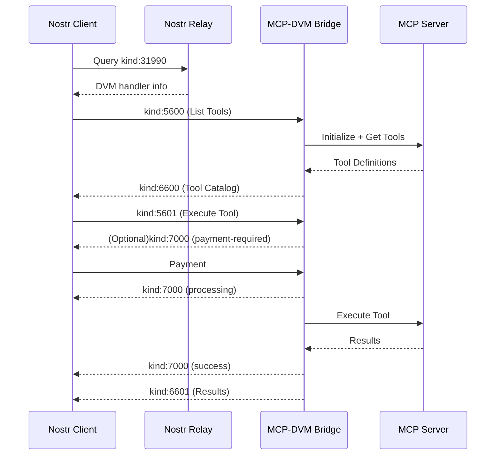

# DVMCP

### Data Vending Machine Context Protocol

#### MCP Integration for Data Vending Machines

`draft`

This document defines how Data Vending Machines can expose Model Context Protocol (MCP) server capabilities through the Nostr network, enabling standardized access to computational tools for machines and humans.

## Introduction

The [Model Context Protocol](https://modelcontextprotocol.io/introduction) provides a robust framework for exposing AI capabilities and tools, while Nostr's Data Vending Machines offer a decentralized marketplace for computational services. This document defines how to bridge these protocols, allowing MCP servers to advertise and provide their services through the Nostr network.

## Motivation

While DVMs already provide a framework for computational services, and MCP offers a standardized way to expose AI capabilities, there hasn't been a standardized way to bridge these protocols. This specification aims to:

1. Enable discovery of MCP services through Nostr's decentralized network
2. Standardize how MCP tools can be exposed as DVM services
3. Provide a consistent experience for users accessing AI capabilities
4. Maintain compatibility with both protocols while preserving their security models

## Protocol Overview

There are three main actors in this workflow:

- Service providers: Entities running MCP servers that expose tools and capabilities
- DVMs: Bridge components that translate between Nostr and MCP protocols
- Customers: Nostr clients that discover and utilize the exposed capabilities

The protocol consists of four main phases:

1. Service Discovery: Finding available MCP-enabled DVMs
2. Tool Discovery: Retrieving available tools from a specific DVM
3. Job Execution: Requesting tool execution and receiving results
4. Job Feedback: Handling payment and status updates

## Event Kinds

This specification defines how to use existing DVM event kinds (5600-7000) for MCP integration:

| Kind | Description                     |
| ---- | ------------------------------- |
| 5600 | Tool discovery request          |
| 6600 | Tool catalog response           |
| 5601 | Tool execution request          |
| 6601 | Tool execution response         |
| 7000 | Job feedback and payment status |

## Service Discovery

Service providers SHOULD announce their DVM capabilities using NIP-89 handler information events. This enables clients to discover MCP-enabled DVMs through Nostr's existing discovery mechanisms.

```json
{
  "kind": 31990,
  "pubkey": "<dvm-pubkey>",
  "content": {
    "name": "MCP Tools DVM",
    "about": "AI and computational tools via MCP"
  },
  "tags": [
    ["d", "<dvm-announcement/random-id>"],
    ["k", "5600"], // Tool discovery
    ["k", "5601"], // Tool execution
    ["capabilities", "mcp-1.0"],
    ["t", "mcp"]
  ]
}
```

### Required Tags

- `d`: A unique identifier for this announcement that should be maintained consistently for announcement updates
- `k`: The event kinds this DVM supports (must include 5600 and 5601 for MCP support)
- `capabilities`: Must include "mcp-1.0" to indicate MCP protocol support
- `t`: Should include "mcp" to aid in discovery

### Tool Discovery Request (kind: 5600)

Clients discover available tools by sending a kind 5600 event. This initiates the tool discovery process.

```json
{
  "kind": 5600,
  "content": "",
  "tags": [
    ["output", "application/json"],
    ["bid", "<msat-amount>"]
  ]
}
```

The `p` tag MAY be included to target a specific provider:

```json
["p", "<provider-pubkey>"]
```

### Tool Catalog Response (kind: 6600)

The DVM MUST respond with a kind 6600 event that lists all available tools and their specifications:

```json
{
  "kind": 6600,
  "content": {
    "tools": [
      {
        "name": "<tool-name>",
        "inputSchema": {
          "type": "object",
          "properties": {
            "text": {
              "type": "string",
              "description": "Input text to process",
              "minLength": 1,
              "maxLength": 10000
            },
            "temperature": {
              "type": "number",
              "description": "Sampling temperature",
              "minimum": 0,
              "maximum": 2,
              "default": 0.7
            },
            "max_tokens": {
              "type": "integer",
              "description": "Maximum tokens to generate",
              "minimum": 1,
              "maximum": 2048
            }
          },
          "required": ["text"],
          "additionalProperties": false,
          "$schema": "http://json-schema.org/draft-07/schema#"
        }
      }
    ]
  },
  "tags": [["e", "<tool-discovery-req-event-id>"]]
}
```

The tool catalog response preserves the full MCP tool definition format, allowing clients to understand:

- Required and optional parameters
- Parameter types and constraints
- Expected response formats

Common parameter and properties types include:

- `string`: Text input with optional length constraints
- `number`: Floating-point values with optional ranges
- `integer`: Whole numbers with optional ranges
- `boolean`: True/false flags
- `array`: Lists of values with optional item constraints
- `object`: Nested parameter structures

## Job Execution

Tools are executed through a request/response pair of events.

### Job Request (kind: 5601)

Tools are executed using a kind 5601 event:

```json
{
  "kind": 5601,
  "content": {
    "name": "<tool-name>",
    "parameters": {
      "text": "The input text to be processed",
      "temperature": 0.8,
      "max_tokens": 1024
    }
  },
  "tags": [["p", "<provider-pubkey>"]]
}
```

The content object MUST include:

- `name`: The name of the tool to execute
- `parameters`: An object matching the tool's inputSchema

The content object MAY include:

- `timeout`: Maximum execution time in milliseconds
- `metadata`: Additional execution context

### Job Response (kind: 6601)

```json
{
  "kind": 6601,
  "content": {
    "content": [
      {
        "type": "text",
        "text": "Primary response text"
      },
      {
        "type": "text",
        "text": "Secondary response text"
      },
      {
        "type": "image/svg+xml",
        "text": "<svg>...</svg>"
      }
    ],
    "isError": false,
    "metadata": {
      "processing_time": 1.23,
      "token_count": 150
    }
  },
  "tags": [
    ["e", "<job-request-id>"],
    ["status", "success"]
  ]
}
```

The response content MUST include:

- `content`: An array of content blocks from the MCP tool execution
- `isError`: Boolean indicating if an error occurred

The response content MAY include:

- `metadata`: Additional context about the execution

Each content block MUST specify:

- `type`: The MIME type of the content
- `text`: The actual content data

## Job Feedback

DVMs use kind 7000 events to provide updates about job status and payment requirements. This enables proper handling of long-running jobs and payment flows.

```json
{
  "kind": 7000,
  "content": "",
  "tags": [
    ["status", "<status>", "<extra-info>"],
    ["amount", "<sat-amount>", "<optional-bolt11>"],
    ["e", "<job-request-id>", "<relay-hint>"],
    ["p", "<customer's-pubkey>"]
  ]
}
```

### Status Values

The `status` tag MUST use one of these values:

- `payment-required`: Payment needed before execution
- `processing`: Job is being processed
- `error`: Job failed to process
- `success`: Job completed successfully
- `partial`: Job partially completed

### Payment Flow

A typical payment flow proceeds as follows:

1. Client submits job request
2. DVM responds requesting payment
3. Client pays the invoice
4. DVM processes the job
5. DVM returns results

## Error Handling

DVMs MUST handle both protocol and execution errors appropriately:

### Protocol Errors

- Invalid request format
- Missing required parameters
- Parameter validation failures
- Unknown tool requests

### Execution Errors

- MCP server connection failures
- Tool execution timeouts
- Resource exhaustion
- Internal errors

For any error, DVMs MUST:

1. Send a kind 7000 event with status "error"
2. Include relevant error details in the content
3. Set isError=true in any kind 6601 response

## Implementation Requirements

DVMs implementing this protocol MUST:

1. Properly handle MCP server initialization and capability negotiation
2. Transform tool definitions and parameters between MCP and DVM formats
3. Validate all parameters against the published schema
4. Implement appropriate job feedback and error handling
5. Follow NIP-89 for service registration
6. Handle payment flows securely
7. Maintain proper state during long-running operations
8. Implement appropriate timeouts and resource limits

## Complete Protocol Flow


