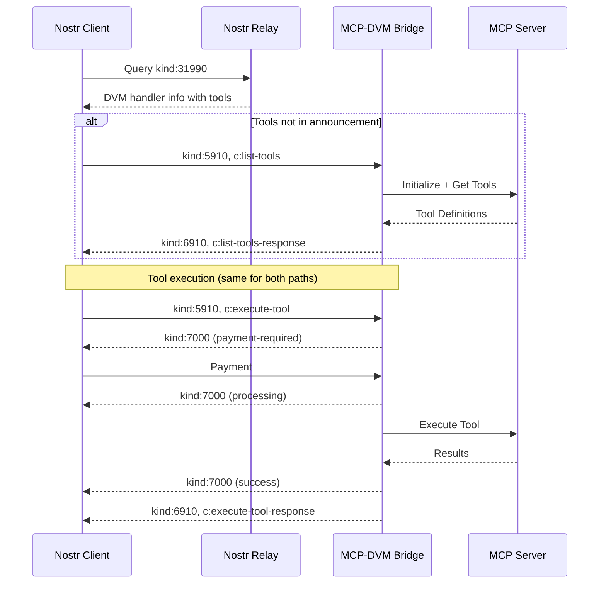

# DVMCP

### Data Vending Machine Context Protocol

#### MCP Integration for Data Vending Machines

`draft`

This document defines how Data Vending Machines can expose Model Context Protocol (MCP) server capabilities through the Nostr network, enabling standardized access to computational tools for machines and humans.

## Introduction

The [Model Context Protocol](https://modelcontextprotocol.io/introduction) provides a robust framework for exposing AI capabilities and tools, while Nostr's Data Vending Machines offer a decentralized marketplace for computational services. This document defines how to bridge these protocols, allowing MCP servers to advertise and provide their services through the Nostr network.

## Motivation

While DVMs already provide a framework for computational services, and MCP offers a standardized way to expose AI capabilities, there hasn't been a standardized way to bridge these protocols. This specification aims to:

1. Enable discovery of MCP services through Nostr's decentralized network
2. Standardize how MCP tools can be exposed as DVM services
3. Provide a consistent experience for users accessing AI capabilities
4. Maintain compatibility with both protocols while preserving their security models

## Protocol Overview

There are three main actors in this workflow:

- Service providers: Entities running MCP servers that expose tools and capabilities
- DVMs: Bridge components that translate between Nostr and MCP protocols
- Customers: Nostr clients that discover and utilize the exposed capabilities

The protocol consists of four main phases:

1. Service Discovery: Finding available MCP-enabled DVMs
2. Tool Discovery: Retrieving available tools from a specific DVM
3. Job Execution: Requesting tool execution and receiving results
4. Job Feedback: Handling payment and status updates

## Event Kinds

Following NIP-90 conventions, this specification defines these event kinds:

| Kind | Description              |
| ---- | ------------------------ |
| 5910 | DVM-MCP Bridge Requests  |
| 6910 | DVM-MCP Bridge Responses |
| 7000 | Job Feedback             |

Operations are differentiated using the `c` tag, which specifies the command being executed:

| Command Value         | Type     | Kind | Description                               |
| --------------------- | -------- | ---- | ----------------------------------------- |
| list-tools            | Request  | 5910 | Request available tools catalog           |
| list-tools-response   | Response | 6910 | Returns available tools and their schemas |
| execute-tool          | Request  | 5910 | Request execution of a specific tool      |
| execute-tool-response | Response | 6910 | Returns the results of tool execution     |

## Service Discovery

Service providers SHOULD announce their DVM capabilities using NIP-89 handler information events. This enables clients to discover MCP-enabled DVMs through Nostr's existing discovery mechanisms.

```json
{
  "kind": 31990,
  "pubkey": "<dvm-pubkey>",
  "content": {
    "name": "MCP Tools DVM",
    "about": "AI and computational tools via MCP"
  },
  "tags": [
    ["d", "<dvm-announcement/random-id>"],
    ["k", "5910"],
    ["capabilities", "mcp-1.0"],
    ["t", "mcp"]
  ]
}
```

### Tool Discovery in Service Announcements

DVMs SHOULD include their available tools directly in their kind:31990 announcement events. This enables immediate tool discovery and execution without requiring an additional request/response cycle. Here's an example of a complete announcement:

```json
{
  "kind": 31990,
  "pubkey": "<dvm-pubkey>",
  "content": {
    "name": "MCP Tools DVM",
    "about": "AI and computational tools via MCP",
    "tools": [
      {
        "name": "summarize",
        "description": "Summarizes text input",
        "inputSchema": {
          "type": "object",
          "properties": {
            "text": {
              "type": "string",
              "description": "Text to summarize"
            }
          }
        }
      }
    ]
  },
  "tags": [
    ["d", "<dvm-announcement/random-id>"],
    ["k", "5910"],
    ["capabilities", "mcp-1.0"],
    ["t", "mcp"],
    ["t", "summarize"]
  ]
}
```

This direct tool listing allows clients to:

1. Execute tools immediately without a discovery step
2. Filter for specific tool capabilities using relay queries
3. Make better decisions about DVM selection based on available tools
4. Reduce network overhead for simple integrations

DVMs MAY fall back to the `list-tools` command (described in the Tool Discovery section) in cases where:

- The tool list is too extensive to include in the announcement
- Tools are dynamically generated or change frequently
- Additional runtime metadata is needed for tool discovery
- The full tool schema would make the announcement too large

### Required Tags

- `d`: A unique identifier for this announcement that should be maintained consistently for announcement updates
- `k`: The event kind this DVM supports (5910 for MCP bridge requests)
- `capabilities`: Must include "mcp-1.0" to indicate MCP protocol support
- `t`: Should include "mcp", and also tool names, to aid in discovery

### Tool Discovery

Clients can also discover available tools by sending a request:

```json
{
  "kind": 5910,
  "content": "",
  "tags": [
    ["c", "list-tools"],
    ["output", "application/json"],
    ["bid", "<msat-amount>"]
  ]
}
```

The `p` tag MAY be included to target a specific provider:

```json
["p", "<provider-pubkey>"]
```

The DVM MUST respond with a kind 6910 event:

```json
{
  "kind": 6910,
  "content": {
    "tools": [
      {
        "name": "<tool-name>",
        "inputSchema": {
          "type": "object",
          "properties": {
            "text": {
              "type": "string",
              "description": "Input text to process",
              "minLength": 1,
              "maxLength": 10000
            },
            "temperature": {
              "type": "number",
              "description": "Sampling temperature",
              "minimum": 0,
              "maximum": 2,
              "default": 0.7
            },
            "max_tokens": {
              "type": "integer",
              "description": "Maximum tokens to generate",
              "minimum": 1,
              "maximum": 2048
            }
          },
          "required": ["text"],
          "additionalProperties": false,
          "$schema": "http://json-schema.org/draft-07/schema#"
        }
      }
    ]
  },
  "tags": [
    ["c", "list-tools-response"],
    ["e", "<tool-discovery-req-event-id>"]
  ]
}
```

## Job Execution

Tools are executed through request/response pairs using kinds 5910/6910.

### Job Request

```json
{
  "kind": 5910,
  "content": {
    "name": "<tool-name>",
    "parameters": {
      "text": "The input text to be processed",
      "temperature": 0.8,
      "max_tokens": 1024
    }
  },
  "tags": [
    ["c", "execute-tool"],
    ["p", "<provider-pubkey>"]
  ]
}
```

The content object MUST include:

- `name`: The name of the tool to execute
- `parameters`: An object matching the tool's inputSchema

The content object MAY include:

- `timeout`: Maximum execution time in milliseconds
- `metadata`: Additional execution context

### Job Response

```json
{
  "kind": 6910,
  "content": {
    "content": [
      {
        "type": "text",
        "text": "Primary response text"
      },
      {
        "type": "text",
        "text": "Secondary response text"
      },
      {
        "type": "image/svg+xml",
        "text": "<svg>...</svg>"
      }
    ],
    "isError": false,
    "metadata": {
      "processing_time": 1.23,
      "token_count": 150
    }
  },
  "tags": [
    ["c", "execute-tool-response"],
    ["e", "<job-request-id>"],
    ["status", "success"]
  ]
}
```

## Job Feedback

Following NIP-90, DVMs use kind 7000 events to provide updates about job status and payment requirements:

```json
{
  "kind": 7000,
  "content": "",
  "tags": [
    ["status", "<status>", "<extra-info>"],
    ["amount", "<sat-amount>", "<optional-bolt11>"],
    ["e", "<job-request-id>", "<relay-hint>"],
    ["p", "<customer's-pubkey>"]
  ]
}
```

### Status Values

The `status` tag MUST use one of these values:

- `payment-required`: Payment needed before execution
- `processing`: Job is being processed
- `error`: Job failed to process
- `success`: Job completed successfully
- `partial`: Job partially completed

### Payment Flow

A typical payment flow proceeds as follows:

1. Client submits job request (kind:5910)
2. DVM responds with payment requirement (kind:7000)
3. Client pays the invoice
4. DVM indicates processing (kind:7000)
5. DVM returns results (kind:6910)

## Error Handling

DVMs MUST handle both protocol and execution errors appropriately:

### Protocol Errors

- Invalid request format
- Missing required parameters
- Parameter validation failures
- Unknown tool requests

### Execution Errors

- MCP server connection failures
- Tool execution timeouts
- Resource exhaustion
- Internal errors

For any error, DVMs MUST:

1. Send a kind:7000 event with status "error"
2. Set isError=true in the kind:6910 response
3. Include relevant error details

## Implementation Requirements

DVMs implementing this protocol MUST:

1. Properly handle MCP server initialization and capability negotiation
2. Transform tool definitions and parameters between MCP and DVM formats
3. Validate all parameters against the published schema
4. Implement appropriate job feedback and error handling
5. Follow NIP-89 for service registration
6. Handle payment flows securely
7. Maintain proper state during long-running operations
8. Implement appropriate timeouts and resource limits

## Complete Protocol Flow



## Future Extensions

Additional commands can be added to support new MCP capabilities by defining new values for the `c` tag. This allows the protocol to evolve without requiring new event kinds. Future commands might include:

- Resource operations (list-resources, read-resource, etc.)
- Prompt operations (list-prompts, execute-prompt, etc.)
- Advanced tool operations (cancel-execution, batch-execute, etc.)

All such extensions MUST maintain the request/response kind relationship defined in NIP-90 (response kind = request kind + 1000) and use kind:7000 for job feedback.
