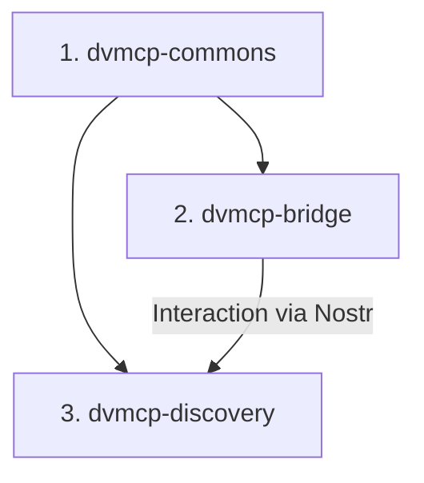

# DVMCP Spec 2025-03-26 Refactoring Plan (Public Discovery Implementation)

This document outlines the plan to refactor the `dvmcp-commons`, `dvmcp-bridge`, and `dvmcp-discovery` packages to comply with the Public Discovery mechanisms and core interaction patterns defined in the DVMCP specification dated 2025-03-26, leveraging the `@modelcontextprotocol/sdk`.

## 1. Summary of Relevant Specification Changes

*   **Event Kinds:** Adoption of new kinds for public announcements (`31316`-`31319`), requests (`25910`), responses (`26910`), and notifications (`21316`). Deprecation of old kinds (`31990`, `5910`, `6910`, `7000`). Distinction between addressable (announcements) and ephemeral (requests, responses, notifications) kinds.
*   **Message Structure:** Standardized use of Nostr event `content` (stringified MCP JSON-RPC) and required `tags` (e.g., `d`, `s`, `p`, `e`, `method`, `cap`). **Note:** MCP JSON-RPC structures within `content` should use types from `@modelcontextprotocol/sdk`.
*   **Public Discovery:** Utilize kinds `31316-31319` for announcing servers and their capabilities (tools, resources, prompts).
*   **Capabilities:** Standardized methods (`tools/list`, `tools/call`, `resources/read`, etc.) using kind `25910` for requests and `26910` for responses. Support for pagination (`cursor`/`nextCursor`).
*   **Notifications:** Unified kind `21316` for MCP-compliant notifications (e.g., `progress`, `list_changed`, `cancel` - identified via `method` tag and JSON-RPC in `content`) and Nostr-specific notifications (e.g., payment required - identified via tags, empty `content`).
*   **Error Handling:** Standardized distinction between Protocol (`error` object) and Execution (`result.isError: true`) errors in kind `26910` responses.

## 2. Refactoring Sequence

The refactoring will proceed in the following order, driven by dependencies:

1.  **`packages/dvmcp-commons`:** Update shared constants and types.
2.  **`packages/dvmcp-bridge`:** Implement server-side changes for public announcements and handling standard interactions.
3.  **`packages/dvmcp-discovery`:** Implement client-side changes for consuming public announcements and performing standard interactions.

## 3. Package-by-Package Breakdown

### 3.1. `packages/dvmcp-commons`

*   **Goal:** Update shared utilities to reflect the DVMCP specification for public discovery and core interactions.
*   **Impacted Files/Modules:**
    *   `constants.ts`: Update event kinds and relevant tags.
    *   `src/types-dvmcp-nostr.ts` (New File): Define DVMCP-specific Nostr event structures (mainly tags).
*   **Refactoring Steps:**
    1.  **Update `constants.ts`:**
        *   Remove/deprecate old kind constants (`DVM_ANNOUNCEMENT_KIND`, `DVM_NOTICE_KIND`, `TOOL_REQUEST_KIND`, `TOOL_RESPONSE_KIND`).
        *   Add new kind constants (`SERVER_ANNOUNCEMENT_KIND = 31316`, `TOOLS_LIST_KIND = 31317`, `RESOURCES_LIST_KIND = 31318`, `PROMPTS_LIST_KIND = 31319`, `REQUEST_KIND = 25910`, `RESPONSE_KIND = 26910`, `NOTIFICATION_KIND = 21316`).
        *   Add constants for relevant DVMCP tags (`TAG_SERVER_ID = 's'`, `TAG_METHOD = 'method'`, `TAG_CAPABILITY = 'cap'`, ensure constants exist for `d`, `p`, `e`, `k` if used directly).
    2.  **Create `src/types-dvmcp-nostr.ts`:**
        *   Define TypeScript interfaces for DVMCP Nostr event formats (e.g., `DvmcpServerAnnouncementEvent`, `DvmcpToolsListEvent`, `DvmcpRequestEvent`, `DvmcpResponseEvent`, `DvmcpNotificationEvent`) emphasizing the expected `tags` structure.
        *   Include comments guiding developers to use types from `@modelcontextprotocol/sdk/types.js` for the structure of the JSON-RPC within the `content` field.

### 3.2. `packages/dvmcp-bridge`

*   **Goal:** Announce capabilities publicly using kinds `31316-31319` and handle standard DVMCP requests (`tools/call`, etc.) using kinds `25910`/`26910`/`21316`.
*   **Impacted Files/Modules:**
    *   `src/dvm-bridge.ts`: Core request, response, notification logic.
    *   `src/announcer.ts`: Publishing announcements.
    *   `src/mcp-client.ts` / `src/mcp-pool.ts`: Translation to backend MCP servers. Consider leveraging SDK server components.
    *   `src/relay.ts`: Nostr event publishing/subscription logic.
    *   `src/payment-handler.ts`: Payment notification logic.
    *   `src/constants.ts`, `src/types.ts`: Align with commons and SDK types.
*   **Refactoring Steps:**
    1.  **Dependencies:** Update imports from `@dvmcp/commons`. Import and use relevant types from `@modelcontextprotocol/sdk/types.js` for MCP payloads in `content`.
    2.  **Announcements (`src/announcer.ts`):**
        *   Remove logic for kind `31990`.
        *   Implement publishing for kind `31316` (Server): Correct `content` structure (using SDK types for `serverInfo`, `capabilities` summary), correct tags (`d`, `k="25910"`, etc.).
        *   Implement publishing for kinds `31317` (Tools), `31318` (Resources - if applicable), `31319` (Prompts - if applicable): Correct `content` structure (using SDK types for lists), correct tags (`d`, `s`, `cap`).
        *   Update NIP-09 deletion to target new announcement event IDs.
    3.  **Request Handling (`src/dvm-bridge.ts`, `src/relay.ts`):**
        *   Update Nostr subscription to listen for kind `25910`.
        *   Update event parsing: Use `method` tag for routing, parse `content` (as stringified JSON-RPC, validate against SDK types), extract `p`, `e`, `s` tags.
        *   Implement handlers for standard capability methods (`tools/list`, `tools/call`, `resources/list`, `resources/read`, etc.), including pagination logic (`cursor` parameter). Route requests to `src/mcp-pool.ts`.
    4.  **Response Handling (`src/dvm-bridge.ts`, `src/mcp-client.ts`):**
        *   Send responses using kind `26910`.
        *   Include `e` tag referencing the request event ID.
        *   Format `content` as stringified JSON-RPC: Use `result` object (with SDK types, `nextCursor` for lists) or `error` object (for protocol errors). Use `result.isError = true` for execution errors.
    5.  **Notification Handling (`src/dvm-bridge.ts`, `src/payment-handler.ts`):**
        *   Update `src/payment-handler.ts`: Send "payment required" using kind `21316`, *empty* `content`, and tags (`status`, `amount`, `e`, `p`). Adapt payment confirmation logic if needed.
        *   Implement sending MCP-compliant notifications (`progress`, `list_changed`, etc.): Use kind `21316`, *non-empty* `content` (stringified JSON-RPC using SDK types), `method` tag, and `p`/`e` tags.
        *   Handle incoming `notifications/cancel` (kind `21316`).
    6.  **MCP Client/Pool (`src/mcp-client.ts`, `src/mcp-pool.ts`):** Ensure translation layer correctly formats calls to backend MCP servers and translates responses/notifications back into the DVMCP Nostr event format, using SDK types for MCP data structures. Evaluate using SDK's `McpServer` components internally.

### 3.3. `packages/dvmcp-discovery`

*   **Goal:** Discover publicly announced DVMs (kinds `31316-31319`) and interact with their capabilities using kinds `25910`/`26910`/`21316`.
*   **Impacted Files/Modules:**
    *   `src/discovery-server.ts`: Core logic, coordinates DVM interactions. Consider leveraging SDK client components.
    *   `src/discovery.ts` (or similar): Public announcement subscription logic.
    *   `src/tool-registry.ts`: State management for discovered capabilities.
    *   `src/tool-executor.ts`: Formatting/sending requests, handling responses/notifications.
    *   `src/nwc-payment.ts`: Payment trigger logic based on notifications.
    *   `src/constants.ts`, `src/types.ts`: Align with commons and SDK types.
*   **Refactoring Steps:**
    1.  **Dependencies:** Update imports from `@dvmcp/commons`. Import and use relevant types/classes from `@modelcontextprotocol/sdk` (e.g., `sdk/types.js`, potentially `sdk/client/index.js`).
    2.  **Public Discovery (`src/discovery-server.ts`, `src/discovery.ts`):**
        *   Update Nostr subscriptions to listen for kinds `31316`, `31317`, `31318`, `31319`.
        *   Update parsing logic for these announcements: Extract data from `content` (using SDK types), use tags (`d`, `s`, `cap`) for correlation and indexing.
        *   Update `src/tool-registry.ts` to handle capability data associated with server identifiers (`s` tag) and manage updates based on addressable events.
    3.  **Request Sending (`src/tool-executor.ts`):**
        *   Format outgoing Nostr requests using kind `25910`.
        *   Populate `content` with stringified JSON-RPC (using SDK types for params).
        *   Include required tags: `p` (target provider), `s` (target server ID), `method`. Generate and include `e` tag for correlation.
        *   Implement sending of standard capability requests (`tools/list`, `tools/call`, etc.), including `cursor` for pagination.
        *   Evaluate using `@modelcontextprotocol/sdk/client/index.js` `Client` class to simplify request formatting and correlation.
    4.  **Response Handling (`src/tool-executor.ts`, `src/discovery-server.ts`):**
        *   Update subscription/handler for kind `26910`.
        *   Update parsing logic: Correlate using `e` tag, parse `content` (using SDK types for result/error). Handle `nextCursor` for lists. Propagate results/errors back to the client connected to the discovery server.
    5.  **Notification Handling (`src/discovery-server.ts`, `src/nwc-payment.ts`, `src/tool-executor.ts`):**
        *   Update subscription/handler for kind `21316`.
        *   Handle MCP-compliant notifications (`progress`, `list_changed`): Parse `content` (using SDK types) and check `method` tag. Update internal state or forward.
        *   Update `src/nwc-payment.ts` trigger: Parse tag-based (`status=payment-required`, `amount`, `invoice`) notifications with *empty* `content`.
        *   Implement sending `notifications/cancel` (kind `21316`) to DVMs.